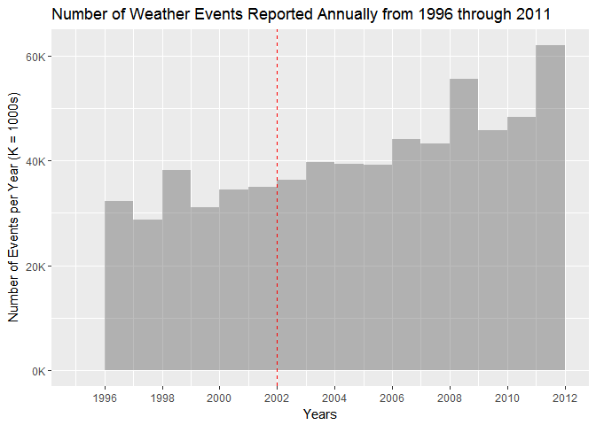
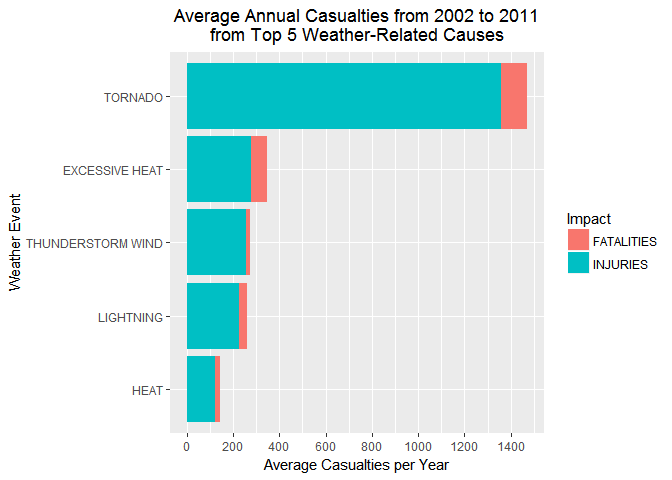
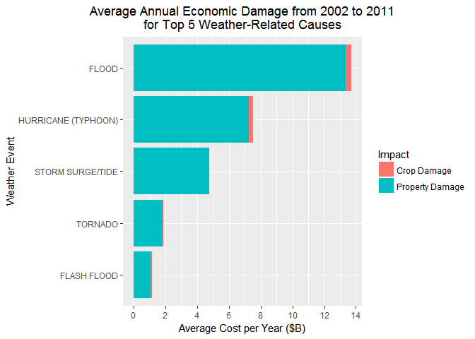

# Impact of US Weather Events from 2002 to 2011
Paul Clark  
January 9, 2017  

***

# Synopsis

Weather events have public health and economic impacts.  We analyze the U.S. National Oceanic and Atmospheric Administration's (NOAA) [National Storm Database][3] to determine which types of events are most harmful.  Over the most recent 10-year period for which data is available, we determine that `TORNADO` events caused the most human casualties (about 40% of all weather-related fatalities and injuries, or 1470 per year), while `FLOOD` events caused the most economic damage (40% of property and crop damage, or $13.7 B per year). `HURRICANE (TYPHOON)` events also caused very significant damage (about 20% of total, or $7.5 B per year).

***

# Data Processing

## Load required packages


```r
mir <- "https://cloud.r-project.org"
if (!require(data.table)) {install.packages("data.table", repos = mir); require(data.table)} # fread
if (!require(R.utils)) {install.packages("R.utils", repos = mir); require(R.utils)} # unzip bz2
if (!require(dplyr)) {install.packages("dplyr", repos = mir); require(dplyr)} # process data
if (!require(ggplot2)) {install.packages("ggplot2", repos = mir); require(ggplot2)} # for charts
if (!require(formattable)) {install.packages("formattable", repos = mir); require(scales)} # tables
if (!require(tidyr)) {install.packages("tidyr", repos = mir); require(tidyr)} # prep data for chrts
rm(mir)
```

## Read data 


```r
# Download bzip2 from url into working dir if needed. Then unzip into data_path dir and read data.
# Skip process if data already resident in working memory.

data_name <- "stdata" # Name of data frame and data file (before extensions)
# 'data_path': This string contains the path to the directory in which you want to store the large,
# unzipped *.csv file.  It is omitted for privacy reasons, but needs to be specified for the below 
# function to work.
data_ext <- ".csv"
zip_ext <- ".bz2"
url <- "https://d396qusza40orc.cloudfront.net/repdata%2Fdata%2FStormData.csv.bz2" # available as of
                                                                                  # 1/1/2017

prep_read_bz2_file <- function(data_name, data_ext, zip_ext, data_path, url) {
        # If source data in environment, end fn, otherwise unzip if necessary and read data
        if (!data_name %in% ls(parent.frame(1))) {
                zipname <- paste0(data_name, data_ext, zip_ext)
                data_file_path <- file.path(data_path, paste0(data_name, data_ext))
                # If neither data file nor zip archive exists, download & unzip
                if (!file.exists(data_file_path) && !file.exists(zipname)) {
                        # Download zip archive into working dir
                        download.file(url, zipname)
                        cat("Please wait while unzipping data file...\n")
                        bunzip2(zipname, data_file_path, remove = FALSE, skip = TRUE)
                # Else must have csv or bz2 or both: unzip if lacking csv
                } else if (!file.exists(data_file_path)) {
                        cat("Please wait while unzipping data file...\n")
                        # Prepare data dir at path location, unzip archive into it
                        if (!file.exists(data_path)) dir.create(data_path, recursive = TRUE)
                        bunzip2(zipname, data_file_path, remove = FALSE, skip = TRUE)
                }                  
        # Read data
        assign(data_name,fread(data_file_path,data.table=FALSE,na.strings=""),
               envir = parent.frame(1))
        }
}
prep_read_bz2_file(data_name, data_ext, zip_ext, data_path, url)
rm(list = c("prep_read_bz2_file", "data_name", "data_ext", "zip_ext", "data_path", "url"))
```
## Inspect data

We inspected the data to understand available variables and relationships among them.  We do not show the results here.

```r
str(stdata)
set.seed(1234)
stdata[sample(nrow(stdata), 10), c("BGN_DATE", "EVTYPE", "REMARKS")]
```

## Subset data

As described in the [NOAA Storm Database Details][3], recorded events have changed over time:

  1. **1950-54:** Tornado
  2. **1955-92:** Tornado, Thunderstorm Wind, Hail (keyed from paper publications into digital data) 
  3. **1993-95:** Tornado, Thunderstorm Wind, Hail (extracted from unformatted text files)
  4. **1996-11:** All event types (48)

To assess *all* event types, we ignore data before 1996.  

Before subsetting, we examine date information to understand the format:

```r
# examine the date information
stdata$BGN_DATE[sample(nrow(stdata), 10)]
```

```
##  [1] "7/14/1974 0:00:00"  "5/1/1954 0:00:00"   "12/14/1987 0:00:00"
##  [4] "11/29/1991 0:00:00" "5/27/2008 0:00:00"  "9/12/2009 0:00:00" 
##  [7] "6/11/2001 0:00:00"  "6/6/2011 0:00:00"   "10/31/2000 0:00:00"
## [10] "9/23/1996 0:00:00"
```
We then transform and subset `BGN_DATE` to match the fourth period of reporting.

```r
# Transform date information so we can subset by date
stdata$BGN_DATE <- as.Date(stdata$BGN_DATE, format = "%m/%d/%Y")
cat("The data extends from", format(min(stdata$BGN_DATE), "%m/%d/%Y"), 
    "to", format(max(stdata$BGN_DATE), "%m/%d/%Y"), ".\n")
```

```
## The data extends from 01/03/1950 to 11/30/2011 .
```

```r
# subset the database for the fourth period
stdata <- stdata[stdata$BGN_DATE >= as.Date("1996-01-01") & stdata$BGN_DATE <= 
                as.Date("2011-12-31"),
         c("BGN_DATE", "BGN_TIME", "TIME_ZONE", "STATE", "COUNTY", "EVTYPE", "FATALITIES",
           "INJURIES", "PROPDMG", "PROPDMGEXP", "CROPDMG", "CROPDMGEXP", "REMARKS", "REFNUM")]
```
We examine period (4) data to see if trends remain. 

```r
(ggplot(stdata, aes(BGN_DATE)) + stat_bin(binwidth = 365.25, center = 365.2/2,
     closed = "right", alpha = 0.4, na.rm = FALSE) + 
     geom_vline(aes(xintercept = as.numeric(as.Date("2002-01-01"))),color="red",linetype="dashed") +
     scale_x_date(date_minor_breaks="1 year",date_breaks = "2 years", date_labels="%Y") +
     scale_y_continuous(labels = function(x) {paste0(x/1000,"K")}) +
     labs(x = "Years", y = "Number of Events per Year (K = 1000s)", title =
     "Number of Weather Events Reported Annually from 1996 through 2011"))
```

<!-- -->
  
There is an upward trend: approximate doubling in events per year over a 15-year period.  We suspect period (4) reporting may have been immature in its early years, therefore we focus analysis on the last 10 years. This is the period to the right of the dotted line in the figure.

```r
yrs <- 10
db_end_date <- max(stdata$BGN_DATE)
stdata_sub <- filter(stdata, BGN_DATE >= db_end_date - yrs*365.25)
cat("The beginning of the selected data range is ", format(min(stdata_sub$BGN_DATE), "%m/%d/%Y"),
    ".\n", sep = "")
```

```
## The beginning of the selected data range is 11/30/2001.
```
We also examine the contents of `EVTYPE`, to see how consistent are the classifications.  There are 126 unique values in `EVTYPE` over the specified time period.  We may have to re-classify and group some of these to match the NOAA standard classification scheme (see below).

```r
unique(stdata_sub$EVTYPE) # for brevity, values are not shown
```
## Cleaning and processing the data

### Investigating NAs and Non-standard values

We first assess and treat any **NAs** and **non-standard values** in the variables used to calculate impact. Variables 1, 2, 3, and 5 are numeric, and 4 and 6 are 'exponents' -- symbols defining factors that multiply the numeric variables to quantify damage impacts.

```r
names(stdata_sub)[7:12]
```

```
## [1] "FATALITIES" "INJURIES"   "PROPDMG"    "PROPDMGEXP" "CROPDMG"   
## [6] "CROPDMGEXP"
```

We find no NAs in any of the numeric fields (variables 1, 2, 3, and 5 above). I.e., the number of **NAs** across all these numbers is `0`:


```r
sum(is.na(stdata_sub$FATALITIES)) + # no NAs in fatalities
sum(is.na(stdata_sub$INJURIES)) +   # no NAs in injuries
sum(is.na(stdata_sub$PROPDMG)) +    # no NAs in property damage values
sum(is.na(stdata_sub$CROPDMG))      # no NAs in crop damage values
```

```
## [1] 0
```

Now we need to understand the `EXP` values (variables 4 and 6 above):  


```r
unique(stdata_sub$PROPDMGEXP)
```

```
## [1] "K" NA  "M" "B" "0"
```

```r
unique(stdata_sub$CROPDMGEXP)
```

```
## [1] NA  "K" "M" "B"
```
The meanings of `"K"`, `"M"`, and `"B"` are clear, but we must investigate how to interpret `NA`s and `"0"`s.  It turns out that the `DMG` numbers are `0` whenever the `EXP` values are `NA` or `"0"` (i.e., the number of times when this is not the case is `0`):

```r
with(stdata_sub, sum(is.na(PROPDMGEXP) & PROPDMG != 0)) + # if exp==NA, PROPDMG == 0
with(stdata_sub, sum(is.na(CROPDMGEXP) & CROPDMG != 0)) + # if exp==NA, CROPDMG == 0
with(stdata_sub, sum(PROPDMGEXP == "0" & PROPDMG != 0))   # if exp=="0", PROPDMG == 0
```

```
## [1] 0
```

Therefore, when computing economic impacts, we interpret damage as `0` whenever `EXP` is **NA** or `"0"`.

### Calculating total health and economic impact

For this analysis, we define the following impacts.

  1.  Total Health Impact = `FATALITIES` + `INJURIES`
  2.  Total Economic Impact = `PROPDMG * exp$fact[PROPDMGEXP]`+`CROPDMG * exp$fact[CROPDMGEXP]`
  
The sum in (2) is pseudo-code for the following: the appropriate factor `fact` is provided by lookup in the data frame `exp` of the value of `PROPDMGEXP` or `CROPDMGEXP`.  The executable code is shown in the code chunk just below, which calculates the crop and property components of *Total Economic Impact*:

```r
# EXP values of NA and "0" will both be ignored, with associated damage set to 0
stdata_sub$PROPDMGEXP[is.na(stdata_sub$PROPDMGEXP)] <- "0"
stdata_sub$CROPDMGEXP[is.na(stdata_sub$CROPDMGEXP)] <- "0"
# We create a dataframe of factors for each EXP value
exp <- data.frame(symb = c("0", "K", "M", "B"), fact = c(0, 1e3, 1e6, 1e9))
# We compute indices in the `exp` dataframe associating the appropriate factor for each damage value
# The indices are then used to retrieve and multiply by the factors
indices <- match(stdata_sub$PROPDMGEXP, exp$symb)
stdata_sub$`prop$` <- stdata_sub$PROPDMG*exp$fact[indices]
indices <- match(stdata_sub$CROPDMGEXP, exp$symb)
stdata_sub$`crop$` <- stdata_sub$CROPDMG*exp$fact[indices]
```
We now add columns for total economic damage and casualties, and remove unneeded columns:

```r
stdata_sub$dollars <- stdata_sub$`crop$` + stdata_sub$`prop$`
stdata_sub$casualties <- stdata_sub$INJURIES + stdata_sub$FATALITIES
stdata_sub <- select(stdata_sub, -PROPDMG,-PROPDMGEXP, -CROPDMG, -CROPDMGEXP)
```

***

# Analysis

We now group by `EVTYPE` and examine which values account for significant impact over time.  

```r
# We look at the values causing the top 99% of impact
# To do so, we first construct a cumulative sum of casualty percentages by `EVTYPE`
cumcutoff <- 0.99
by_type_cas <- group_by(stdata_sub, EVTYPE) %>% summarize_each(funs(sum), casualties, dollars) %>%
        arrange(desc(casualties)) %>% mutate(pct_casualties = casualties/sum(casualties),
        pct_dollars = dollars/sum(dollars)) %>% mutate(pctcumsum_cas = cumsum(pct_casualties))
```
## Initial Assessment

### Health Impact

Percentage of 10-year casualties by *raw* `EVTYPE` value:

```r
transmute(by_type_cas, EVTYPE, pct_casualties = formattable::percent(pct_casualties,1))
```

```
## # A tibble: 126 × 2
##               EVTYPE    pct_casualties
##                <chr> <S3: formattable>
## 1            TORNADO             42.4%
## 2     EXCESSIVE HEAT             10.1%
## 3          LIGHTNING              7.6%
## 4  THUNDERSTORM WIND              4.4%
## 5               HEAT              4.2%
## 6  HURRICANE/TYPHOON              3.9%
## 7          TSTM WIND              3.5%
## 8        FLASH FLOOD              3.0%
## 9           WILDFIRE              2.8%
## 10         HIGH WIND              1.7%
## # ... with 116 more rows
```

### Economic Impact

Percentage of 10-yr economic damage by *raw* `EVTYPE` value:

```r
# We start with the `by_type_cas` data, then re-arrange and add a cumulative percentage of damage
by_type_tot <- arrange(by_type_cas, desc(dollars)) %>% mutate(pctcumsum_doll = cumsum(pct_dollars))
transmute(by_type_tot, EVTYPE, pct_dollars = formattable::percent(pct_dollars,1))
```

```
## # A tibble: 126 × 2
##               EVTYPE       pct_dollars
##                <chr> <S3: formattable>
## 1              FLOOD             41.0%
## 2  HURRICANE/TYPHOON             21.5%
## 3        STORM SURGE             12.9%
## 4            TORNADO              5.6%
## 5        FLASH FLOOD              3.4%
## 6               HAIL              3.2%
## 7            DROUGHT              2.0%
## 8          HIGH WIND              1.6%
## 9           WILDFIRE              1.5%
## 10  STORM SURGE/TIDE              1.4%
## # ... with 116 more rows
```
## Refinement of Assessment

To refine the assessment, we take the database event type values that account for 99% of the impact, then group and standardize them to conform to the 48 event types defined for official NOAA reporting.  This improves the assessment by grouping values that describe the same type of weather event.  

Event type values that account for the top 99% of harm:

```r
topPct <- filter(by_type_tot, pctcumsum_cas <= cumcutoff | pctcumsum_doll <= cumcutoff)
(arrange(topPct, EVTYPE) %>% select(EVTYPE))$EVTYPE
```

```
##  [1] "AVALANCHE"               "COLD/WIND CHILL"        
##  [3] "DENSE FOG"               "DROUGHT"                
##  [5] "DUST STORM"              "EXCESSIVE HEAT"         
##  [7] "EXTREME COLD/WIND CHILL" "FLASH FLOOD"            
##  [9] "FLOOD"                   "FOG"                    
## [11] "FROST/FREEZE"            "HAIL"                   
## [13] "HEAT"                    "HEAVY RAIN"             
## [15] "HEAVY SNOW"              "HEAVY SURF/HIGH SURF"   
## [17] "HIGH SURF"               "HIGH WIND"              
## [19] "HURRICANE"               "HURRICANE/TYPHOON"      
## [21] "ICE STORM"               "LIGHTNING"              
## [23] "RIP CURRENT"             "RIP CURRENTS"           
## [25] "STORM SURGE"             "STORM SURGE/TIDE"       
## [27] "STRONG WIND"             "THUNDERSTORM WIND"      
## [29] "TORNADO"                 "TROPICAL STORM"         
## [31] "TSTM WIND"               "TSUNAMI"                
## [33] "WILD/FOREST FIRE"        "WILDFIRE"               
## [35] "WINTER STORM"            "WINTER WEATHER"         
## [37] "WINTER WEATHER/MIX"
```
Over the last 10 years of data, only 37 event type values (out of the total 126) explain 99% of the impact.  However, some values do not match any of the official 48 listed in the [Storm Data Documentation][1].  We group and standardize the above types to match those in the documentation, page 6, _**Storm Data Event Table**_. We have copy/pasted the contents of the table into a *.csv file, and read and list them here:

```r
(event_types <- read.csv("event_types.csv", stringsAsFactors = FALSE))$Event.Name
```

```
##  [1] "Astronomical Low Tide"    "Avalanche"               
##  [3] "Blizzard"                 "Coastal Flood"           
##  [5] "Cold/Wind Chill"          "Debris Flow"             
##  [7] "Dense Fog"                "Dense Smoke"             
##  [9] "Drought"                  "Dust Devil"              
## [11] "Dust Storm"               "Excessive Heat"          
## [13] "Extreme Cold/Wind Chill"  "Flash Flood"             
## [15] "Flood"                    "Frost/Freeze"            
## [17] "Funnel Cloud"             "Freezing Fog"            
## [19] "Hail"                     "Heat"                    
## [21] "Heavy Rain"               "Heavy Snow"              
## [23] "High Surf"                "High Wind"               
## [25] "Hurricane (Typhoon)"      "Ice Storm"               
## [27] "Lake-Effect Snow"         "Lakeshore Flood"         
## [29] "Lightning"                "Marine Hail"             
## [31] "Marine High Wind"         "Marine Strong Wind"      
## [33] "Marine Thunderstorm Wind" "Rip Current"             
## [35] "Seiche"                   "Sleet"                   
## [37] "Storm Surge/Tide"         "Strong Wind"             
## [39] "Thunderstorm Wind"        "Tornado"                 
## [41] "Tropical Depression"      "Tropical Storm"          
## [43] "Tsunami"                  "Volcanic Ash"            
## [45] "Waterspout"               "Wildfire"                
## [47] "Winter Storm"             "Winter Weather"
```

Standardization/grouping of database values to match the official 48:

```r
stdata_sub$stdEVTYPE <- stdata_sub$EVTYPE
stdata_sub <- within(stdata_sub, {
                          stdEVTYPE[stdEVTYPE == "FOG"] <- "DENSE FOG"
                          stdEVTYPE[stdEVTYPE == "HEAVY SURF/HIGH SURF"] <- "HIGH SURF"
                          stdEVTYPE[stdEVTYPE == "HURRICANE"] <- "HURRICANE (TYPHOON)"
                          stdEVTYPE[stdEVTYPE == "HURRICANE/TYPHOON"] <- "HURRICANE (TYPHOON)"
                          stdEVTYPE[stdEVTYPE == "RIP CURRENTS"] <- "RIP CURRENT"
                          stdEVTYPE[stdEVTYPE == "STORM SURGE"] <- "STORM SURGE/TIDE"
                          stdEVTYPE[stdEVTYPE == "TSTM WIND"] <- "THUNDERSTORM WIND"
                          stdEVTYPE[stdEVTYPE == "WILD/FOREST FIRE"] <- "WILDFIRE"
                          stdEVTYPE[stdEVTYPE == "WINTER WEATHER/MIX"] <- "WINTER WEATHER"
              })
```

***

# Results

For the final assessment, we focus only on the top 5 event types in health and economic damage.


```r
rankcutoff <- 5
by_type_cas_tbl <- group_by(stdata_sub, stdEVTYPE) %>% summarize_each(funs(sum), 
        FATALITIES, INJURIES, `prop$`, `crop$`, casualties, dollars) %>%
        arrange(desc(casualties)) %>% mutate(pct_casualties = casualties/sum(casualties),
        pct_dollars = dollars/sum(dollars)) %>% mutate(rank_cas = rank(-pct_casualties))
by_type_tot_tbl <- arrange(by_type_cas_tbl, desc(dollars)) %>% 
                        mutate(rank_doll = rank(-pct_dollars))
topPct_cas_tbl <- filter(by_type_tot_tbl, rank_cas <= rankcutoff) %>%
                        arrange(desc(casualties))
topPct_doll_tbl <- filter(by_type_tot_tbl, rank_doll <= rankcutoff)
```

## Health Impact

The event type causing the most casualties (nationally) is `TORNADO`, followed at a distant second by `EXCESSIVE HEAT`:

```r
# Display table of health impact
transmute(topPct_cas_tbl, `Standard Event Type` = stdEVTYPE, 
     `% Casualties over 10 yrs` = formattable::percent(pct_casualties, 1), 
     `Avg casualties per yr` = paste0(digits(casualties/yrs, 0), " / yr")) %>% as.data.frame %>%
      formattable(caption = "Table 1: Casualties by Event Type for Top 5 Causes of Casualty from 2002 to 2011")
```


<table class="table table-condensed">
<caption>Table 1: Casualties by Event Type for Top 5 Causes of Casualty from 2002 to 2011</caption>
 <thead>
  <tr>
   <th style="text-align:right;"> Standard Event Type </th>
   <th style="text-align:right;"> % Casualties over 10 yrs </th>
   <th style="text-align:right;"> Avg casualties per yr </th>
  </tr>
 </thead>
<tbody>
  <tr>
   <td style="text-align:right;"> TORNADO </td>
   <td style="text-align:right;"> 42.4% </td>
   <td style="text-align:right;"> 1470 / yr </td>
  </tr>
  <tr>
   <td style="text-align:right;"> EXCESSIVE HEAT </td>
   <td style="text-align:right;"> 10.1% </td>
   <td style="text-align:right;"> 349 / yr </td>
  </tr>
  <tr>
   <td style="text-align:right;"> THUNDERSTORM WIND </td>
   <td style="text-align:right;"> 7.9% </td>
   <td style="text-align:right;"> 275 / yr </td>
  </tr>
  <tr>
   <td style="text-align:right;"> LIGHTNING </td>
   <td style="text-align:right;"> 7.6% </td>
   <td style="text-align:right;"> 262 / yr </td>
  </tr>
  <tr>
   <td style="text-align:right;"> HEAT </td>
   <td style="text-align:right;"> 4.2% </td>
   <td style="text-align:right;"> 145 / yr </td>
  </tr>
</tbody>
</table>
Grouping and standardizing `EVTYPE` values has reversed the casualty ranking of `THUNDERSTORM WIND` and `LIGHTNING` events, moving `THUNDERSTORM WIND` above `LIGHTNING`.  This is because we added the casualties from the original database value `TSTM WIND` (around 4%) to those captured in the official event type `THUNDERSTORM WIND` (also around 4%).  

```r
# Create data frame for chart by gathering FATALITIES and INJURIES into a single column
top_cas_chrt <- select(topPct_cas_tbl, stdEVTYPE:INJURIES, rank_cas) %>% 
                gather(Impact, Casualties, FATALITIES:INJURIES) %>% 
                rename(`Weather Event` = stdEVTYPE) %>%
                mutate(`Average Casualties per Year` = Casualties/yrs)

# Set order of factor levels w/i `Weather Event` so that event types are displayed in descending
# order
top_cas_chrt <- within(top_cas_chrt, `Weather Event` <- 
                        factor(`Weather Event`, levels =
                        `Weather Event`[Impact == 
                        "INJURIES"][order(-rank_cas[Impact == "INJURIES"])]))

(ggplot(top_cas_chrt, aes(x = `Weather Event`, y = `Average Casualties per Year`, fill = Impact)) +
                geom_col() + coord_flip() + scale_y_continuous(breaks = seq(0,1600,200), 
                minor_breaks = seq(0,1600,100)) + labs(title = 
                "Average Annual Casualties from 2002 to 2011\nfrom Top 5 Weather-Related Causes") +
                theme(plot.title = element_text(hjust = 0.5)))
```

<!-- -->
  
One can see here that the vast majority of casualties are injuries. Also, `TORNADO` events cause the most `FATALITIES` as well as total casualties.

The magnitude of casualties by event type (hundreds per year) seems small, intuitively. As a next step outside the scope of this analysis, we would validate the magnitudes by comparison with other data/analyses.

## Economic Impact

The event types causing the most economic damage (nationally) are `FLOOD` and `HURRICANE (TYPHOON)`, which cost many billions of dollars per year, on average:

```r
transmute(topPct_doll_tbl, `Standard Event Type` = stdEVTYPE, `% Cost over 10 yrs` =
        formattable::percent(pct_dollars,1), `Avg cost per yr` = paste0("$ ", 
        digits(dollars/yrs/1e9, 1), " Billion / yr")) %>% as.data.frame %>% 
        formattable(caption = "Table 2: Cost by Event Type for Top 5 Causes of Damage from 2002 to 2011")
```


<table class="table table-condensed">
<caption>Table 2: Cost by Event Type for Top 5 Causes of Damage from 2002 to 2011</caption>
 <thead>
  <tr>
   <th style="text-align:right;"> Standard Event Type </th>
   <th style="text-align:right;"> % Cost over 10 yrs </th>
   <th style="text-align:right;"> Avg cost per yr </th>
  </tr>
 </thead>
<tbody>
  <tr>
   <td style="text-align:right;"> FLOOD </td>
   <td style="text-align:right;"> 41.0% </td>
   <td style="text-align:right;"> $ 13.7 Billion / yr </td>
  </tr>
  <tr>
   <td style="text-align:right;"> HURRICANE (TYPHOON) </td>
   <td style="text-align:right;"> 22.6% </td>
   <td style="text-align:right;"> $ 7.5 Billion / yr </td>
  </tr>
  <tr>
   <td style="text-align:right;"> STORM SURGE/TIDE </td>
   <td style="text-align:right;"> 14.3% </td>
   <td style="text-align:right;"> $ 4.8 Billion / yr </td>
  </tr>
  <tr>
   <td style="text-align:right;"> TORNADO </td>
   <td style="text-align:right;"> 5.6% </td>
   <td style="text-align:right;"> $ 1.9 Billion / yr </td>
  </tr>
  <tr>
   <td style="text-align:right;"> FLASH FLOOD </td>
   <td style="text-align:right;"> 3.4% </td>
   <td style="text-align:right;"> $ 1.2 Billion / yr </td>
  </tr>
</tbody>
</table>
  
As compared to the initial assessment, `STORM SURGE/TIDE` moves up by 1.4% due to inclusion of costs from the unofficial value `STORM SURGE`. `HURRICANE (TYPHOON)` moves up by 1.1% for a similar reason. 


```r
# Create data frame for chart by gathering property damage and crop damage into a single column
top_doll_chrt <- select(topPct_doll_tbl, stdEVTYPE, `prop$`, `crop$`, rank_doll) %>%
                rename(`Weather Event` = stdEVTYPE, 
                       `Property Damage` = `prop$`, `Crop Damage` = `crop$`) %>%
                gather(Impact, Cost, `Property Damage`:`Crop Damage`) %>% 
                mutate(`Average Cost per Year ($B)` = Cost/yrs/1e9)

# Set order of factor levels w/i `Weather Event` so that event types are displayed in descending
# order
top_doll_chrt <- within(top_doll_chrt, `Weather Event` <- 
                        factor(`Weather Event`, levels = `Weather Event`[Impact ==
                        "Property Damage"][order(-rank_doll[Impact == "Property Damage"])]))

(ggplot(top_doll_chrt, aes(x = `Weather Event`, y = `Average Cost per Year ($B)`, fill = Impact)) +
        geom_col() + coord_flip() + scale_y_continuous(breaks = seq(0,16,2)) +
        labs(title = 
        "Average Annual Economic Damage from 2002 to 2011\nfor Top 5 Weather-Related Causes") +
        theme(plot.title = element_text(hjust = 0.5)))
```

<!-- -->
  
The above chart shows average annual economic damage for the top 5 weather related causes. The cost of crop damage is dwarfed by property damage, even for flood-related events.  
  

The magnitude of costs (many billions per year) seems huge. As a next step outside the scope of this analysis, we would validate the magnitudes by comparison with other data/analyses.

***

# Key References

  *  Coursera as of 1/9/17
     -  National Weather Service [Storm Data Documentation][1]
     -  National Climatic Data Center Storm Events [FAQ][2]
  *  NOAA as of 1/9/17
     -  NOAA [National Storm Database Details][3]

***

# Appendix (sessionInfo)


```r
sessionInfo()
```

```
## R version 3.3.2 (2016-10-31)
## Platform: x86_64-w64-mingw32/x64 (64-bit)
## Running under: Windows 7 x64 (build 7601) Service Pack 1
## 
## locale:
## [1] LC_COLLATE=English_United States.1252 
## [2] LC_CTYPE=English_United States.1252   
## [3] LC_MONETARY=English_United States.1252
## [4] LC_NUMERIC=C                          
## [5] LC_TIME=English_United States.1252    
## 
## attached base packages:
## [1] stats     graphics  grDevices utils     datasets  methods   base     
## 
## other attached packages:
## [1] tidyr_0.6.0         formattable_0.2.0.1 ggplot2_2.2.0      
## [4] dplyr_0.5.0         R.utils_2.5.0       R.oo_1.21.0        
## [7] R.methodsS3_1.7.1   data.table_1.10.0  
## 
## loaded via a namespace (and not attached):
##  [1] Rcpp_0.12.8      knitr_1.15.1     magrittr_1.5     munsell_0.4.3   
##  [5] colorspace_1.3-2 R6_2.2.0         plyr_1.8.4       stringr_1.1.0   
##  [9] tools_3.3.2      grid_3.3.2       gtable_0.2.0     DBI_0.5-1       
## [13] htmltools_0.3.5  lazyeval_0.2.0   yaml_2.1.14      rprojroot_1.1   
## [17] digest_0.6.10    assertthat_0.1   tibble_1.2       htmlwidgets_0.8 
## [21] evaluate_0.10    rmarkdown_1.3    labeling_0.3     stringi_1.1.2   
## [25] scales_0.4.1     backports_1.0.4
```


[1]:https://d396qusza40orc.cloudfront.net/repdata%2Fpeer2_doc%2Fpd01016005curr.pdf
[2]:https://d396qusza40orc.cloudfront.net/repdata%2Fpeer2_doc%2FNCDC%20Storm%20Events-FAQ%20Page.pdf
[3]:https://www.ncdc.noaa.gov/stormevents/details.jsp


